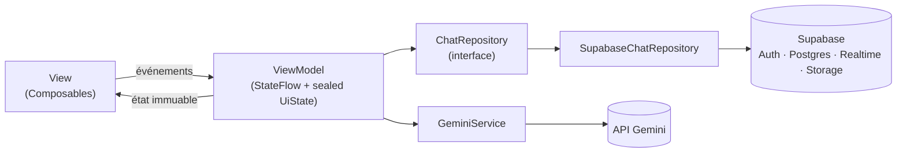

# ChatApp — Messagerie Android temps réel avec agent IA

Application de messagerie Android native (Kotlin + Jetpack Compose) avec **chat temps réel**, **médias**, **présence en ligne** et un **agent conversationnel Gemini en streaming**.

> Projet réalisé dans le cadre du TP Kotlin — ESGIS.

---

## ✨ Fonctionnalités

### Messagerie
- **Inscription / connexion** par email + mot de passe (Supabase Auth)
- **Liste unifiée des conversations** (humaines et IA) triée par dernier message
- **Chat texte en temps réel** (Supabase Realtime / WebSocket)
- **Accusés de réception** : ✓ envoyé / ✓✓ lu, mis à jour **en direct**
- **Annuaire des utilisateurs** avec statut **en ligne / hors ligne** (Realtime Presence)
- **Photos** (Supabase Storage + Coil) et **messages vocaux** (enregistrement + lecture)
- **Notifications locales** à la réception d'un message

### Agent IA
- Conversation avec un **agent Gemini** affiché comme un contact normal
- **Réponse en streaming** (SSE), token par token
- **3 personas** au choix (généraliste, juridique, technique) = 3 *system prompts*
- L'**historique** des N derniers messages est envoyé à chaque requête

### Interface
- **Material 3**, thème de marque (teal) avec accent violet pour l'IA
- **Mode sombre** complet
- Navigation par **onglets** (Discussions / Utilisateurs)

---

## 🏗️ Architecture — MVVM



- **Flux unidirectionnel** : la Vue émet des événements, le ViewModel expose un état immuable.
- La **Vue n'accède jamais** à la couche données (seules les permissions Android y restent).
- Le repository est une **interface** → implémentation Supabase interchangeable et **mockable en test**.
- **Injection de dépendances** légère via un `ServiceLocator` (pas de Hilt, conformément au sujet).

### Structure

```
app/src/main/java/com/esgis/chatapp/
├── data/            # Modèles, repository, services (Gemini, Realtime, Presence, Audio…)
├── di/              # SupabaseModule, ServiceLocator
└── ui/
    ├── auth/        # AuthScreen + AuthViewModel
    ├── conversations/
    ├── chat/        # Chat, streaming IA, personas
    ├── users/       # Annuaire
    ├── components/  # Avatar…
    └── theme/       # Couleurs, typo, formes
app/src/test/        # Tests unitaires des ViewModels
```

---

## 🛠️ Stack technique

| Domaine | Technologie |
|---|---|
| Langage / UI | Kotlin 2.0.21 · Jetpack Compose · Material 3 |
| Backend | Supabase (Auth, Postgres + RLS, Realtime, Storage) via `supabase-kt` 3.0.1 |
| Réseau | Ktor 3.0.1 (moteur **OkHttp** — requis pour les WebSockets) |
| IA | API Gemini (`streamGenerateContent`, SSE) |
| Images | Coil |
| Tests | JUnit 4 · `kotlinx-coroutines-test` |

**minSdk 24** (Android 7.0) · **compileSdk / targetSdk 36**

---

## 🚀 Installation

### 1. Prérequis
- Android Studio (JDK 17+)
- Un compte [Supabase](https://supabase.com) et une clé API [Google AI Studio](https://aistudio.google.com)

### 2. Base de données
Dans ton projet Supabase → **SQL Editor** → colle et exécute le contenu de [`schema.sql`](schema.sql).
Il crée les tables (`profiles`, `conversations`, `participants`, `messages`), les politiques **RLS**, la publication **Realtime** et le bucket **`media`**.

### 3. Réglage Auth (important)
**Authentication → Providers → Email → désactiver « Confirm email »**.
Sinon l'inscription ne crée pas de session et l'application reste bloquée.

### 4. Clés d'API
Crée un fichier **`local.properties`** à la racine (il est ignoré par Git, **ne le commite jamais**) :

```properties
sdk.dir=C:\\chemin\\vers\\Android\\Sdk

SUPABASE_URL=https://<ton-projet>.supabase.co
SUPABASE_ANON_KEY=<ta-cle-anon>
GEMINI_API_KEY=<ta-cle-gemini>
```

> ⚠️ `SUPABASE_URL` doit être l'**URL de base** du projet, sans `/rest/v1`.

Les clés sont injectées à la compilation via `BuildConfig`.

### 5. Compiler et lancer

```bash
./gradlew installDebug     # installe sur l'appareil/émulateur connecté
# ou : ./gradlew assembleDebug  → app/build/outputs/apk/debug/app-debug.apk
```

---

## 🧪 Tests

```bash
./gradlew testDebugUnitTest
```

12 tests unitaires de ViewModels (validation des formulaires, états `Loading/Success/Error`, navigation, présence) exécutés avec une **doublure du repository** (`FakeChatRepository`) — aucun accès réseau.

---

## 🌿 Organisation Git

Une branche par fonctionnalité majeure, fusionnée dans `main` :

```
feature/auth · feature/realtime-chat · feature/ai-agent · feature/media
feature/presence · feature/audio-notifications · feature/users-directory
feature/redesign · feature/redesign-components · feature/mvvm-hardening
```

---

## ⚠️ Limites connues

- Notifications **locales** uniquement (pas de push FCM en arrière-plan).
- Le modèle Gemini utilisé est `gemini-flash-lite-latest` (modifiable dans `GeminiService`), les modèles disponibles en offre gratuite variant selon le projet Google.
- Textes de l'interface non externalisés dans `strings.xml` (pas d'internationalisation).
- Pas de chiffrement bout-en-bout.
